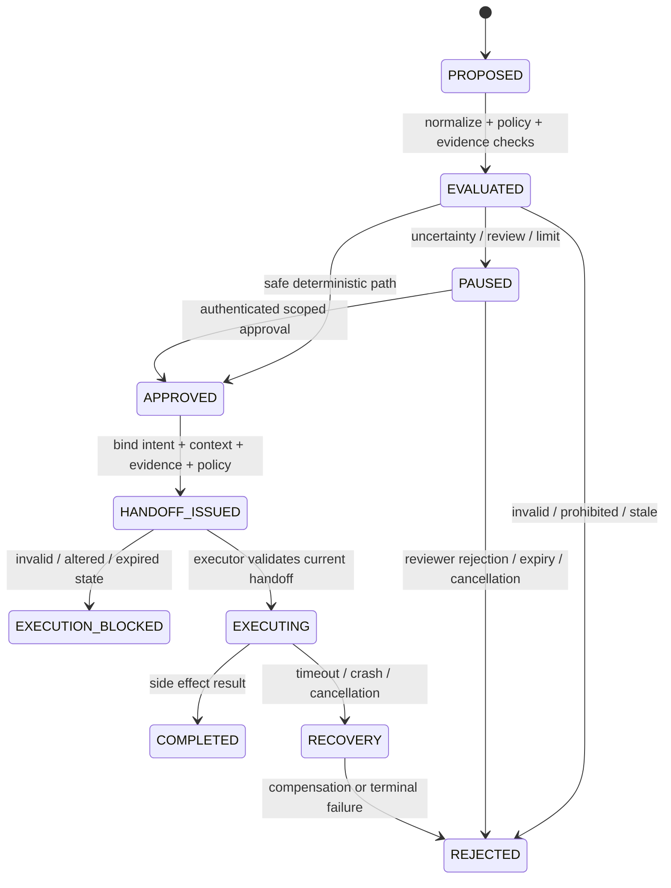

# CX0 Contract and Threat-Model Extension

| Field | Value |
|---|---|
| Phase | `CX0` |
| Scope | Workflow context, tool intent, evidence envelope, decision record, and control events |
| Compatibility | Existing `EvaluationRequest`, `GuardDecision`, and handoff contracts remain supported; CX0 contracts are additive |
| Design posture | Fail closed; retrieved content and model output are untrusted proposals |

## Purpose

CX0 establishes the contracts required before adding complex workflow orchestration or first-class RAG behavior. The contracts make workflow identity, intent semantics, evidence trust, and decision lineage explicit without adding framework-specific authorization branches to the kernel.

## Contract summary

| Contract | Required fields | Safety property |
|---|---|---|
| `WorkflowRunContext` | Run, tenant, root agent, parent/step, attempt, delegation chain, deadline, budgets, kill-switch epoch, policy snapshot | Every step has durable identity and attenuated authority |
| `ToolIntent` | Versioned schema, canonical arguments, action class, resource scope, destination, idempotency key, side-effect mode, provenance | Handoff inputs can be deterministically hashed and semantically compared |
| `EvidenceEnvelope` | Source, tenant scope, content hash, provenance, time bounds, trust, classification, lineage, citations, redacted reference | Retrieved content cannot silently become authorization |
| `DecisionRecord` | Run/step/attempt, intent hash, evidence IDs, policy snapshot, status, reason codes | Decision reconstruction uses references, not raw sensitive content |
| `ControlEvent` | Event type, actor, run/step, time, redacted payload | Append-only operational lineage can be added without payload leakage |

## Canonicalization rules

`ToolIntent.canonical_bytes()` serializes the complete versioned contract using sorted keys, compact separators, UTF-8, and `allow_nan=False`. The SHA-256 digest is the stable intent identity. Semantically different arguments, destinations, policy fields, or side-effect declarations produce different contract values and therefore different hashes. Canonicalization is performed before future handoff-v2 signing.

Workflow child contexts must attenuate authority. A child may use only a subset of the parent tools, consume no larger budget, and use no later deadline. The tenant, root agent, policy snapshot, and kill-switch epoch are inherited. The child cannot add authority by changing its delegation chain.

Evidence envelopes never accept raw content. They require a content hash and redacted reference. Authorization-bearing evidence requires the `trusted` trust class. Freshness is evaluated against observation and expiry timestamps; stale evidence is not treated as current authorization.

## Trust boundaries

| Boundary | Input | Required treatment |
|---|---|---|
| Model → control plane | Proposed tool intent | Validate schema, provenance, policy, and limits; never treat as authorization |
| Retrieval source → RAG boundary | Text/chunks/metadata | Tenant/source/egress checks; content remains untrusted |
| Evidence producer → control plane | Evidence envelope | Require attributable/trusted producer for authorization-bearing use |
| Reviewer → control plane | Approval event | Authenticate identity and bind approval to intent/evidence/policy snapshot |
| Control plane → executor | Decision and handoff | Validate current state and request-bound signature immediately before side effect |

## Adversarial cases

| Threat | CX0 response | Expected outcome |
|---|---|---|
| Prompt injection asks the agent to ignore policy | Model output is only `MODEL` provenance | Cannot grant authority; later RAG boundary must signal/pause |
| Cross-tenant retrieval chunk | `tenant_scope` is explicit | Reject at retrieval/evidence boundary |
| Stale citation | `observed_at`/`expires_at` and `is_fresh()` | Pause or reject; never silently authorize |
| Delegation escalation | Child attenuation checks | Reject added tools, larger budgets, or later deadline |
| Altered arguments | Deterministic canonical hash | Handoff-v2 validation fails |
| Duplicate resume | Attempt and state-machine contracts reserved | CX-4 must make resolution idempotent and current-state bound |
| Deadline expiry | Context deadline is immutable for step | CX-1/CX-4 must produce typed expiry block |
| Raw sensitive evidence in audit | Raw content forbidden; redacted reference required | Contract validation fails before persistence |

## State-transition model

## Compatibility and migration

The current MVP contracts remain available for existing adapters and pilot integrations. CX0 is additive: callers can construct a `WorkflowRunContext`, `ToolIntent`, and `EvidenceEnvelope` alongside the existing `EvaluationRequest`. CX-1 will bind context and budgets into durable transitions; CX-2 will introduce the stronger handoff envelope. No framework adapter may introduce a parallel authorization path.

## Acceptance decision

CX0 contracts are versioned with `contract_version: cx0`, sensitive content is redacted by construction, consequential identity fields are present, child delegation cannot broaden authority, and malformed or unknown-trust envelopes fail closed through validation. CX0 is ready for CX-1 implementation.
